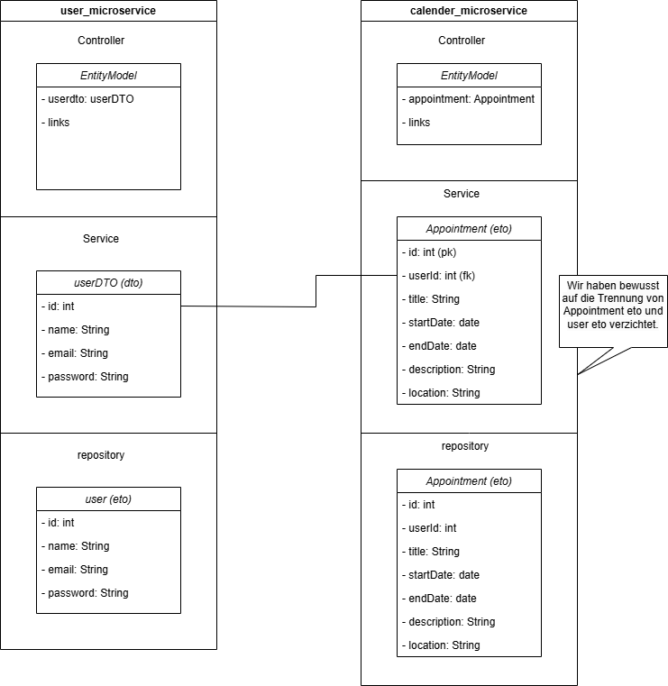
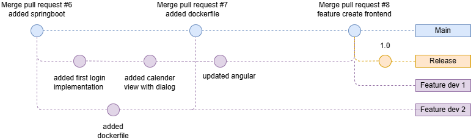
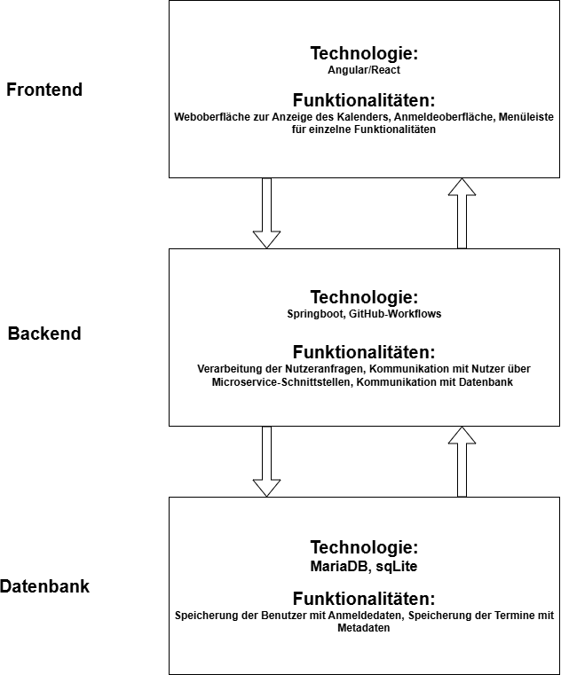

# Kalender
DevOps-Projekt: CRUD-Webapplikation


# USAGE
## benötigte Tools:
- Docker version 26.1.3, build 26.1.3-0ubuntu1~24.04.1
- docker-compose version 1.29.2

## Nutzer:
Step by step:
1. download: compose.yaml 
1. download: .env (optional: Auswählen der gewünschten Release-Version bspw. 1.0.1)
1. run: ``` docker-compose --file compose.yaml up ```
1. open: "http://localhost:4200/login"


## Entwickler:
Step by step:
1. clone Repo
1. run: ``` export GIT_COMMIT=$(git rev-parse HEAD) ```

Online Version
1. run: ``` docker-compose pull```
1. run: ``` docker-compose up --no-build```

lokales Build
1. run: ``` docker-compose up --build```
---

# CRUD-Methoden


Appointments: /api/calendar

POST /addAppointment → Neues Event erstellen

GET /getAppointments/{id} → Alle Events eines bestimmten Nutzers abrufen

PUT /events/{id} → Ein Event aktualisieren

DELETE /events/{id} → Event löschen

User: /api/users

POST /save → Neuen Benutzer erstellen

GET /all → Alle Benutzer erhalten

GET /{id} → ein bestimmten Benutzer erhalten

PUT /{id} → ein bestimmten Benutzer aktualisieren

DELETE /{id} → ein bestimmten Benutzer löschen

# Workflow


# Setup Dev-Environment

- npm v10.9.2
- nodejs v18.19.1
- java: openjdk-21
- maven: Apache Maven 3.3.2
- mariadb  Ver 15.1 Distrib 10.6.18-MariaDB
- docker
- docker-compose
- DBeaver (if gui is needed)
- IntelliJ (as IDE)

## Setup MariaDB
- MariaDB should run on port 3306
- username: root
- password: verysecret
- create two databases manually:
-- userdatabase
-- calendardatabase


## Set-Up Backend-Microservices
- both Spring boot Microservices should run at the same time
```
$ cd Website/user_microservice (or open as new IntelliJ project)
$ mvn spring-boot:run (or click green Start-Button in IntelliJ)

$ cd Website/calendar_microservice (or open as new IntelliJ project)
$ mvn spring-boot:run (or click green Start-Button in IntelliJ)
```

## Set-Up Frontend
```
$ cd Website/frontend
$ npm install
$ ng serve
```
